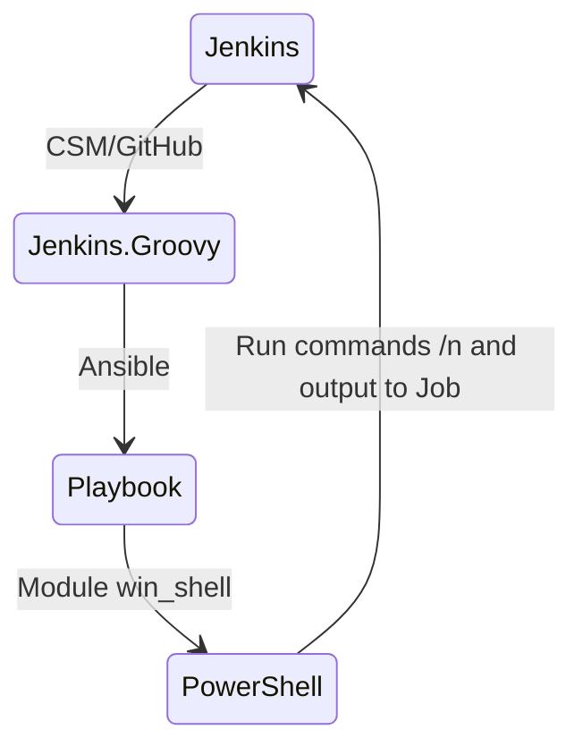

## Pipeline Service Manager

Jenkins pipeline for service manager

**Stack:** Jenkins, Git, Ansible, PowerShell/Bash

```mermaid
stateDiagram-v2
    Jenkins --> Jenkins.Groovy: CSM/GitHub
    Jenkins.Groovy --> Playbook: Ansible
    Playbook --> PowerShell: Module win_shell
    PowerShell --> Jenkins: Run commands /n and output to Job
```

