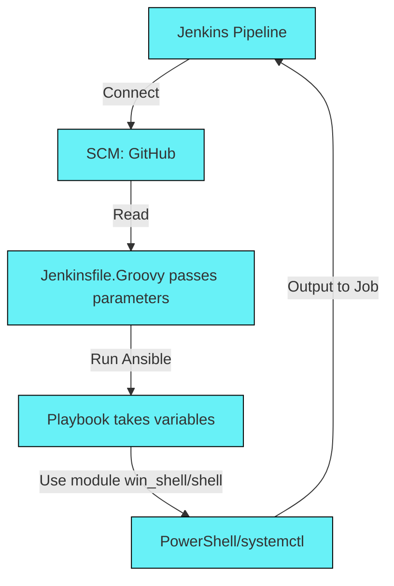

## Pipeline Service Manager

Jenkins pipeline for service management to Windows and Linux system.

**Stack:** 
- **Jenkins** (tested v2.416).
- Service Control Manager (use **GitHub**).
- **Ansible** (tested v2.10.8). Use module win_shell (from the collection ansible.windows) and shell.
- Executable code: **PowerShell/systemctl**.

## Scheme of work

## Job

## Parameters

**ServiceName**. For Windows systems the default is Fildcard format. For Linux use formate *name* (not supported for StartType mode). \
**System**: Windows/Linux
**State**: Start/Stop/Restart
**StartType**: Enabled mode - for system Linux. Automatic/Manual mode - for system Windows. Delayed Start mode - supported only to PowerShell 7.

## Output

### Settings Git

Use the current **public repository** for your pipeline. Hosts list and variables for playbook are used on the local Ansible server.

